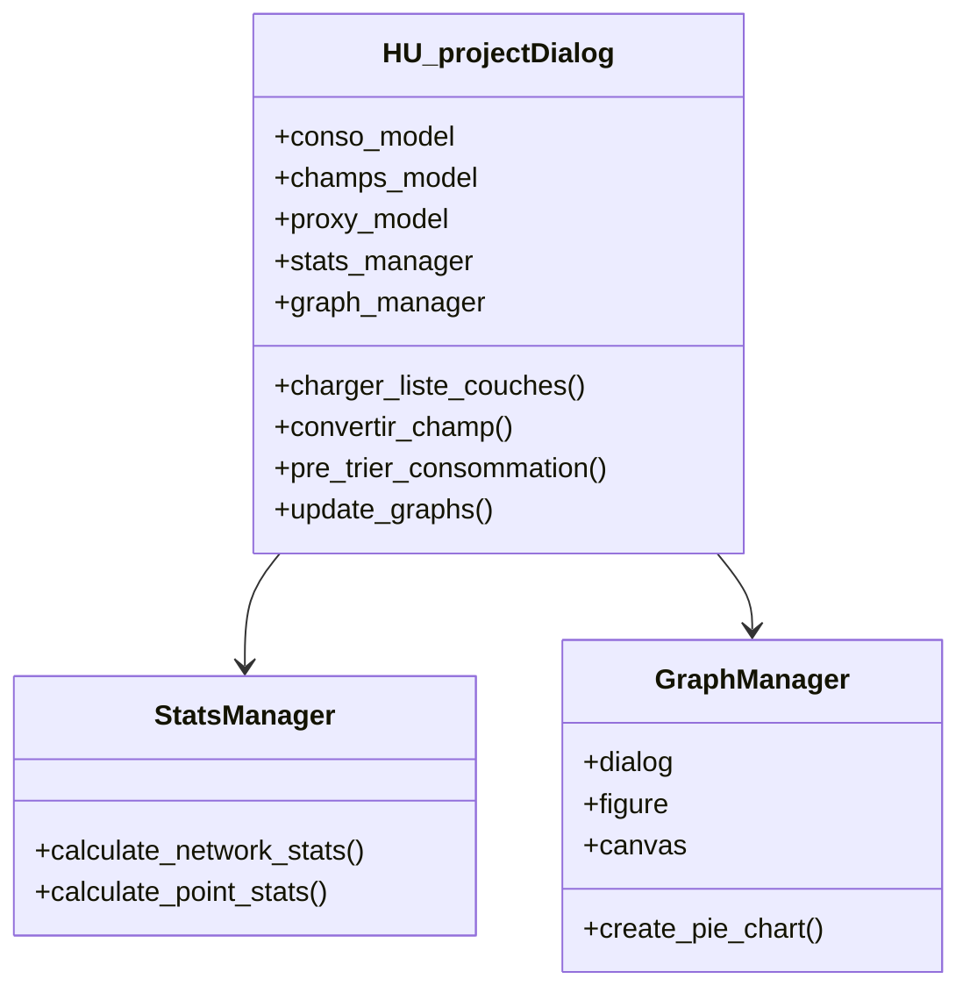

# Documentation des Classes

## HU_projectDialog

Classe principale du plugin qui gère l'interface utilisateur et les fonctionnalités principales.

### Attributs

- `conso_model`: QStandardItemModel - Modèle pour la table des consommations
- `champs_model`: QStandardItemModel - Modèle pour la table des champs
- `proxy_model`: QSortFilterProxyModel - Modèle pour le tri des données
- `stats_manager`: StatsManager - Gestionnaire des statistiques
- `graph_manager`: GraphManager - Gestionnaire des graphiques
- `current_graph`: int - Index du graphique actuellement affiché
- `graphs`: list - Liste des graphiques générés

### Méthodes principales

#### Gestion des couches
```python
def charger_liste_couches(self):
    """Charge la liste des couches vectorielles du projet dans la liste déroulante."""
```

#### Conversion des champs
```python
def convertir_champ(self, type_field, type_name, need_precision=False):
    """Convertit un ou plusieurs champs vers le type spécifié."""
```

#### Gestion des consommations
```python
def pre_trier_consommation(self):
    """Ajoute et remplit les champs Conso_ret et type_conso."""
```

#### Statistiques et graphiques
```python
def update_graphs(self):
    """Met à jour les graphiques avec les options sélectionnées."""
```

## StatsManager

Classe gérant le calcul des statistiques pour les réseaux et les points.

### Méthodes

```python
def calculate_network_stats(self, layers, selected_fields, use_length=True):
    """Calcule les statistiques pour les couches réseau."""

def calculate_point_stats(self, layers, selected_fields):
    """Calcule les statistiques pour les couches de points."""
```

## GraphManager

Classe gérant la création et l'affichage des graphiques.

### Attributs

- `dialog`: HU_projectDialog - Référence vers la boîte de dialogue principale
- `figure`: Figure - Figure matplotlib
- `canvas`: FigureCanvas - Canvas pour l'affichage des graphiques

### Méthodes

```python
def create_pie_chart(self, data, title, show_legend=True, show_values=True, show_percentages=True):
    """Crée un graphique en camembert avec les options spécifiées."""
```

## Diagramme de classes



## Interactions entre les classes

1. `HU_projectDialog` initialise `StatsManager` et `GraphManager`
2. `StatsManager` calcule les statistiques utilisées par `GraphManager`
3. `GraphManager` crée les visualisations affichées dans `HU_projectDialog`

## Notes d'implémentation

- Les classes utilisent le pattern Observer pour la mise à jour des interfaces
- La gestion de la mémoire est optimisée pour les grands jeux de données
- Les graphiques sont créés de manière asynchrone pour éviter le blocage de l'interface 